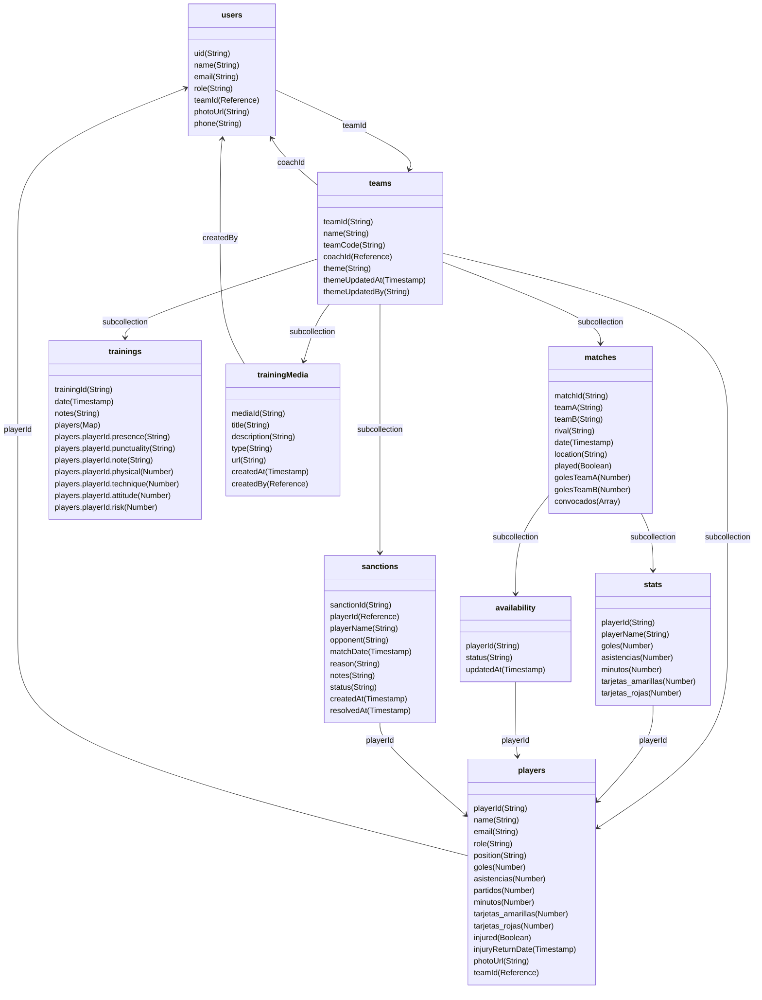

# Diagrama de Base de Datos - TeamPulse

## Estructura de Firestore



---

## 📋 Detalle de Colecciones y Campos

### 1. **users** (Colección raíz)
Almacena información de todos los usuarios (entrenadores y jugadores).

| Campo | Tipo | Descripción |
|-------|------|-------------|
| `uid` | string | ID único del usuario (Firebase Auth) |
| `name` | string | Nombre completo |
| `email` | string | Correo electrónico |
| `role` | string | "entrenador" o "jugador" |
| `teamId` | string | Referencia al equipo (foreign key) |
| `photoUrl` | string | URL de la foto de perfil |
| `phone` | string | Número de teléfono (opcional) |

**Relaciones:**
- `teamId` → referencia a `teams/{teamId}`

---

### 2. **teams** (Colección raíz)
Información de cada equipo deportivo.

| Campo | Tipo | Descripción |
|-------|------|-------------|
| `teamId` | string | ID único del equipo |
| `name` | string | Nombre del equipo |
| `teamCode` | string | Código de invitación único |
| `coachId` | string | ID del entrenador (foreign key) |
| `theme` | string | Tema visual seleccionado |
| `themeUpdatedAt` | timestamp | Última actualización del tema |
| `themeUpdatedBy` | string | Usuario que actualizó el tema |

**Subcolecciones:**
- `players/` - Jugadores del equipo
- `matches/` - Partidos del equipo
- `trainings/` - Entrenamientos
- `trainingMedia/` - Recursos multimedia de entrenamientos
- `sanctions/` - Sanciones de jugadores

---

### 3. **teams/{teamId}/players** (Subcolección)
Datos específicos de cada jugador dentro de un equipo.

| Campo | Tipo | Descripción |
|-------|------|-------------|
| `playerId` | string | ID del jugador (mismo que user uid) |
| `name` | string | Nombre del jugador |
| `email` | string | Email del jugador |
| `role` | string | "jugador" |
| `position` | string | Posición en el campo |
| `goles` | number | Total de goles |
| `asistencias` | number | Total de asistencias |
| `partidos` | number | Partidos jugados |
| `minutos` | number | Minutos jugados |
| `tarjetas_amarillas` | number | Tarjetas amarillas |
| `tarjetas_rojas` | number | Tarjetas rojas |
| `injured` | boolean | Estado de lesión |
| `injuryReturnDate` | timestamp | Fecha estimada de recuperación |
| `photoUrl` | string | Foto del jugador |
| `teamId` | string | Referencia al equipo |

**Relaciones:**
- `playerId` → referencia a `users/{uid}`
- `teamId` → referencia a `teams/{teamId}`

---

### 4. **teams/{teamId}/matches** (Subcolección)
Información de partidos del equipo.

| Campo | Tipo | Descripción |
|-------|------|-------------|
| `matchId` | string | ID único del partido |
| `teamA` | string | Nombre del equipo A (local) |
| `teamB` | string | Nombre del equipo B (rival) |
| `rival` | string | Nombre del equipo rival |
| `date` | timestamp | Fecha y hora del partido |
| `location` | string | Ubicación del partido |
| `played` | boolean | Si el partido se jugó |
| `golesTeamA` | number | Goles del equipo A |
| `golesTeamB` | number | Goles del equipo B |
| `convocados` | array | Lista de IDs de jugadores convocados |

**Subcolecciones:**
- `stats/` - Estadísticas individuales del partido
- `availability/` - Disponibilidad de jugadores

---

### 5. **teams/{teamId}/matches/{matchId}/stats** (Subcolección)
Estadísticas individuales de cada jugador en un partido específico.

| Campo | Tipo | Descripción |
|-------|------|-------------|
| `playerId` | string | ID del jugador |
| `playerName` | string | Nombre del jugador |
| `goles` | number | Goles en este partido |
| `asistencias` | number | Asistencias en este partido |
| `minutos` | number | Minutos jugados |
| `tarjetas_amarillas` | number | Tarjetas amarillas recibidas |
| `tarjetas_rojas` | number | Tarjetas rojas recibidas |

**Relaciones:**
- `playerId` → referencia a `teams/{teamId}/players/{playerId}`

---

### 6. **teams/{teamId}/matches/{matchId}/availability** (Subcolección)
Estado de disponibilidad de cada jugador para un partido.

| Campo | Tipo | Descripción |
|-------|------|-------------|
| `playerId` | string | ID del jugador |
| `status` | string | "available", "not_available", "maybe" |
| `updatedAt` | timestamp | Última actualización |

**Relaciones:**
- `playerId` → referencia a `teams/{teamId}/players/{playerId}`

---

### 7. **teams/{teamId}/trainings** (Subcolección)
Sesiones de entrenamiento del equipo.

| Campo | Tipo | Descripción |
|-------|------|-------------|
| `trainingId` | string | ID único del entrenamiento |
| `date` | timestamp | Fecha y hora del entrenamiento |
| `notes` | string | Notas generales del entrenador |
| `players` | map | Mapa de jugadores con datos individuales |
| `players.{playerId}.presence` | string | "present", "absent", "late" |
| `players.{playerId}.punctuality` | string | Puntualidad |
| `players.{playerId}.note` | string | Nota personalizada para el jugador |
| `players.{playerId}.physical` | number | Calificación física (1-5) |
| `players.{playerId}.technique` | number | Calificación técnica (1-5) |
| `players.{playerId}.attitude` | number | Calificación de actitud (1-5) |
| `players.{playerId}.risk` | number | Nivel de riesgo de lesión (1-5) |

---

### 8. **teams/{teamId}/trainingMedia** (Subcolección)
Recursos multimedia compartidos para entrenamientos (videos, fotos, documentos).

| Campo | Tipo | Descripción |
|-------|------|-------------|
| `mediaId` | string | ID único del recurso |
| `title` | string | Título del recurso |
| `description` | string | Descripción (opcional) |
| `type` | string | "video", "photo", "document" |
| `url` | string | URL del recurso (YouTube, Drive, etc.) |
| `createdAt` | timestamp | Fecha de creación |
| `createdBy` | string | ID del usuario creador |

---

### 9. **teams/{teamId}/sanctions** (Subcolección)
Sanciones aplicadas a jugadores (tarjetas, suspensiones).

| Campo | Tipo | Descripción |
|-------|------|-------------|
| `sanctionId` | string | ID único de la sanción |
| `playerId` | string | ID del jugador sancionado |
| `playerName` | string | Nombre del jugador |
| `opponent` | string | Equipo rival en el partido |
| `matchDate` | timestamp | Fecha del partido |
| `reason` | string | Motivo de la sanción |
| `notes` | string | Notas adicionales |
| `status` | string | "pending", "served" |
| `createdAt` | timestamp | Fecha de creación |
| `resolvedAt` | timestamp | Fecha de resolución |

**Relaciones:**
- `playerId` → referencia a `teams/{teamId}/players/{playerId}`

---

## 🔗 Relaciones entre Colecciones

### Flujo de Referencias Principal

```
users.teamId ──────────────────────────────────► teams.teamId
                                                       │
                                                       ├──► players (jugadores del equipo)
                                                       ├──► matches (partidos)
                                                       │      ├──► stats (estadísticas)
                                                       │      └──► availability (disponibilidad)
                                                       ├──► trainings (entrenamientos)
                                                       ├──► trainingMedia (recursos multimedia)
                                                       └──► sanctions (sanciones)
```

### Claves Foráneas (Foreign Keys)

| De → A | Relación |
|--------|----------|
| `users.teamId` → `teams.teamId` | Usuario pertenece a un equipo |
| `teams.coachId` → `users.uid` | Equipo tiene un entrenador |
| `players.playerId` → `users.uid` | Jugador referencia usuario |
| `stats.playerId` → `players.playerId` | Estadística pertenece a jugador |
| `availability.playerId` → `players.playerId` | Disponibilidad de jugador |
| `sanctions.playerId` → `players.playerId` | Sanción aplicada a jugador |

---

## 📊 Índices y Consultas Frecuentes

### Consultas Comunes

1. **Obtener jugadores de un equipo:**
   ```
   teams/{teamId}/players
   ```

2. **Partidos no jugados ordenados por fecha:**
   ```
   teams/{teamId}/matches
   .where('played', '==', false)
   .orderBy('date', 'asc')
   ```

3. **Sanciones pendientes de un jugador:**
   ```
   teams/{teamId}/sanctions
   .where('playerId', '==', playerId)
   .where('status', '==', 'pending')
   ```

4. **Estadísticas de un jugador en todos los partidos:**
   ```
   teams/{teamId}/matches/{matchId}/stats
   .where('playerId', '==', playerId)
   ```

---

## 🔐 Reglas de Seguridad

Las reglas de seguridad se definen en `firestore.rules` y controlan:
- Solo entrenadores pueden modificar datos del equipo
- Jugadores pueden ver datos del equipo pero no modificar
- Usuarios solo pueden modificar su propio perfil
- Sanciones solo pueden ser gestionadas por entrenadores

---

**Última actualización:** Diciembre 2025
